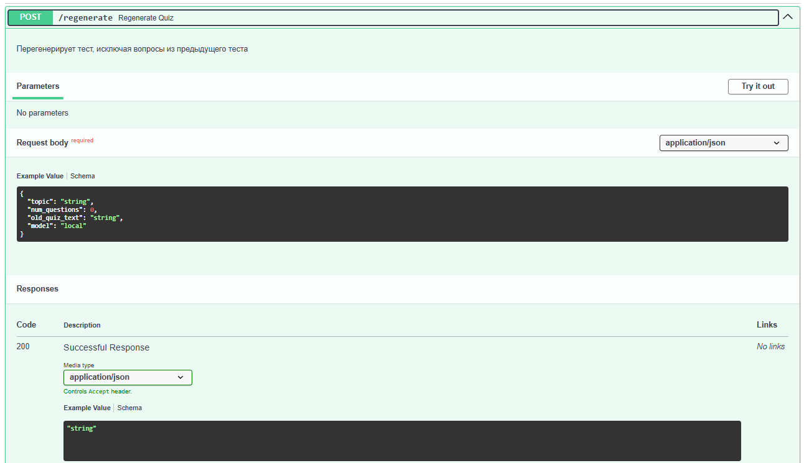
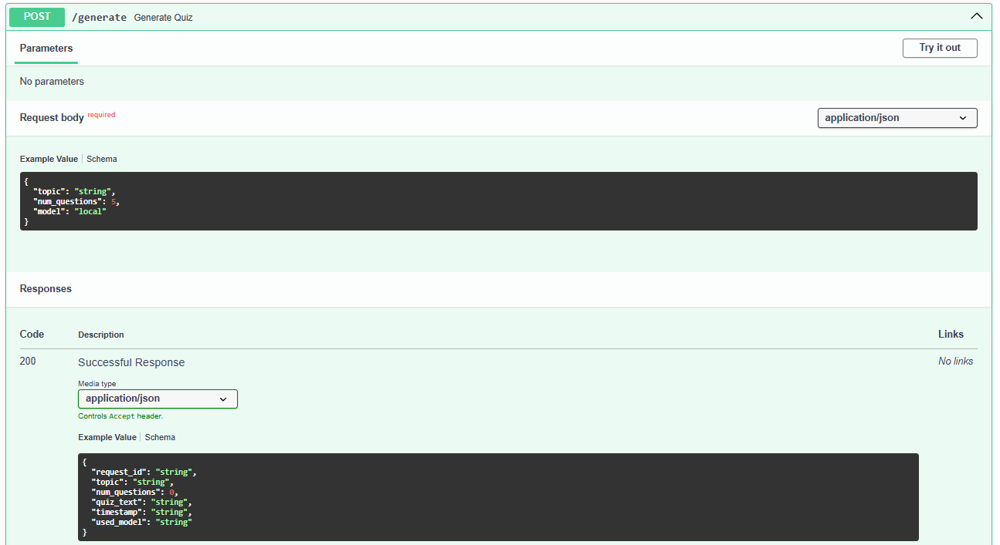
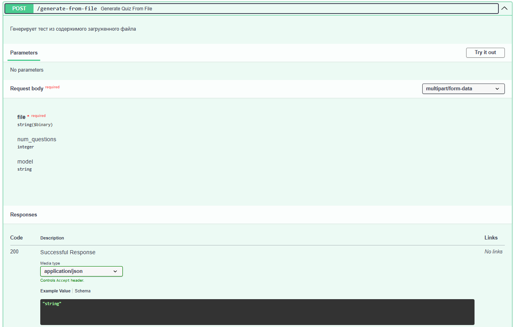
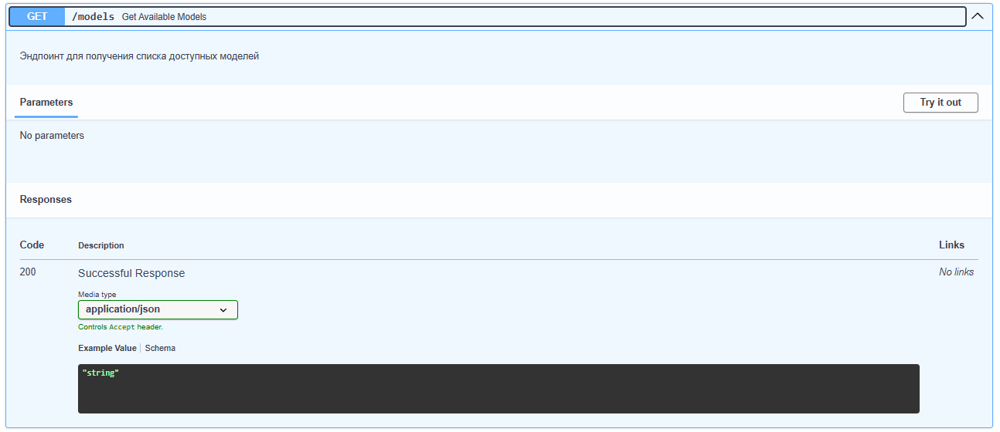
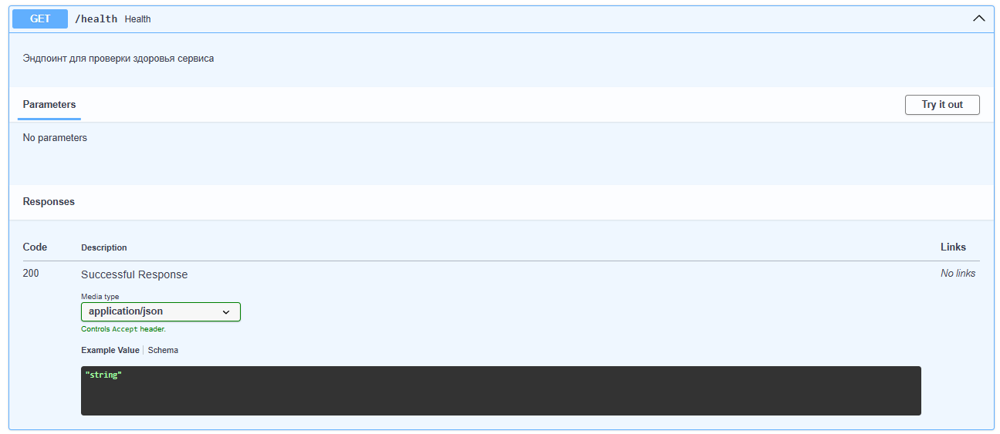

# 📝 Генератор учебных тестов на основе ИИ

[](https://www.docker.com/)
[](https://www.python.org/)
[](https://fastapi.tiangolo.com/)
[](https://streamlit.io/)

## 📋 Описание проекта

Сервис для автоматической генерации учебных тестов с использованием современных языковых моделей (LLM). Позволяет создавать тесты на любую тему или на основе загруженных файлов (TXT, PDF, DOCX, CSV). Поддерживает несколько моделей ИИ, регистрацию пользователей, хранение истории генераций и версионирование тестов.

### Решаемая задача
Автоматическая генерация тестовых заданий для образовательных целей. Сервис помогает быстро создавать проверочные материалы по любой теме или на основе предоставленных материалов.

### Основные возможности
- 🎓 Генерация тестов на любую тему
- 📁 Генерация тестов из файлов (TXT, PDF, DOCX, CSV)
- 👤 Регистрация и аутентификация пользователей
- 📜 Хранение истории всех генераций
- 🔄 Версионирование тестов (перегенерация с сохранением истории)
- 🤖 Поддержка нескольких моделей ИИ:
  - Ollama + llama3.2:3b (локальная, ~2GB, не требует API)
  - Google Gemini API
- 📋 Копирование сгенерированных тестов в буфер обмена

---

## 🏗️ Архитектура сервиса

> *Схема архитектуры представлена в отдельном файле `scheme.png` или в отчёте по курсовой работе.*

### Компоненты системы

| Компонент | Технология | Назначение |
|-----------|------------|------------|
| **Модуль 1: Пользовательский интерфейс** | Streamlit | Веб-интерфейс для ввода темы, загрузки файлов и просмотра результатов |
| **Модуль 2: Инференс** | FastAPI | API сервис для генерации тестов, общение с LLM |
| **Модуль 3: Хранение данных** | PostgreSQL | Хранение пользователей, тестов и версий |
| **Локальная LLM** | Ollama | Бесплатная локальная модель (Llama 3.2, Gemma 2) |
| **Внешняя LLM** | Google Gemini API | Облачная модель (требуется API ключ) |

### Протоколы взаимодействия

| Компоненты | Протокол |
|------------|----------|
| Frontend ↔ Backend | HTTP/REST (JSON API) |
| Backend ↔ PostgreSQL | TCP (порт 5432) |
| Backend ↔ Ollama | HTTP (порт 11434) |
| Backend ↔ Gemini | HTTPS |

### Обоснование выбора технологий

| Технология | Причина выбора                                                                                            |
|------------|-----------------------------------------------------------------------------------------------------------|
| **Streamlit** | Быстрый прототип UI, минимальный код, встроенная поддержка session state, идеально для демонстрации       |
| **FastAPI** | Высокая производительность, асинхронность, автоматическая OpenAPI документация, простота интеграции с LLM |
| **PostgreSQL** | Надёжность, ACID транзакции, поддержка сложных запросов для истории версий                                |
| **Ollama** | Полностью локальная работа без API ключей, простота запуска в Docker, хорошее качество генерации          |
| **Gemini API** | Бесплатный API key, пример интеграции с API GPT                                                           |
| **Docker** | Изоляция сервисов, воспроизводимость, одна команда для запуска                                            |

---

## Структура репозиторя 
```bash
test-generator-service/
├── frontend/                    # Модуль 1: Веб-интерфейс (Streamlit)
│   ├── app.py                   # Главное приложение Streamlit
│   ├── auth.py                  # Регистрация и аутентификация
│   ├── db_client.py             # Клиент для работы с PostgreSQL
│   ├── inference_client.py      # HTTP клиент для FastAPI
│   ├── logger_config.py         # Настройка логирования
│   ├── Dockerfile
│   └── requirements.txt
│
├── backend/                     # Модуль 2: Инференс (FastAPI)
│   ├── app.py                   # FastAPI приложение (эндпоинты)
│   ├── llm_client.py            # Клиент для LLM (Gemini, Ollama, заглушка)
│   ├── prompts.py               # Промпты для генерации
│   ├── db_client.py             # Сохранение логов в БД
│   ├── logger_config.py         # Настройка логирования
│   ├── Dockerfile
│   └── requirements.txt
│
├── database/                    # Модуль 3: PostgreSQL инициализация
│   ├── 01_schema.sql            # Создание таблиц
│   └── 02_indexes.sql           # Создание индексов
│
├── ollama/                      # Контейнер для локальной LLM
│   └── Dockerfile               # Автозагрузка модели llama3.2
│
├── screenshots/                 # Скриншоты работы сервиса/запросов
│   ├── generate_quiz.png
│   ├── file_upload.png
│   ├── history.png
│   └── main_page.png
│
├── docker-compose.yml           # Оркестрация всех сервисов
├── .env.example                 # Шаблон переменных окружения
├── .gitignore
└── README.md                    # Этот файл
```

## 🚀 Инструкция по установке и запуску

### Требования
- Docker Desktop (Windows/Mac) или Docker + Docker Compose (Linux)
- 4-8 GB RAM (для локальных моделей Ollama)
- 5-10 GB свободного места на диске (для моделей Ollama)

### Быстрый старт

```bash
# 1. Клонируйте репозиторий
git clone https://github.com/your-username/test-generator-service.git
cd test-generator-service

# 2. Создайте файл с переменными окружения
cp .env.example .env

# 3. Отредактируйте .env (добавьте GEMINI_API_KEY, если хотите использовать Gemini, отредактируйте LOG_LEVEL, GEMINI_MODEL)
# Получить бесплатный ключ: https://aistudio.google.com/app/apikey

# 4. Запустите всё одной командой!
docker-compose up --build
```

## Примеры запросов





